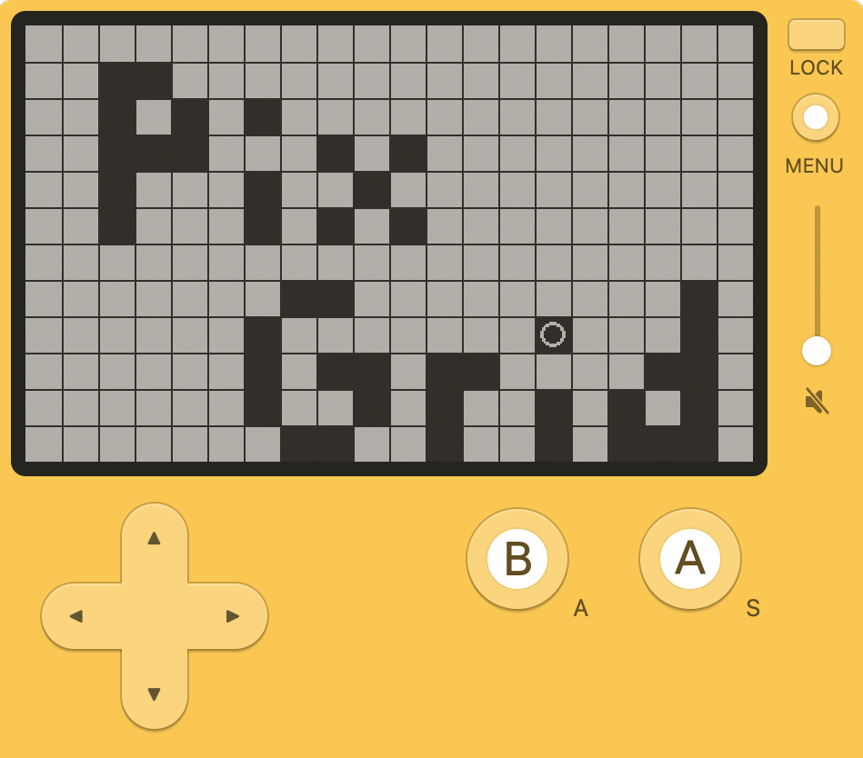

# Pix Grid

A simple pixel art toy for the [Playdate](https://play.date/).

- Move with d-pad.
- Toggle a pixel between black and white with A.
  - Keep holding A to draw a line.
- Erase all squares with B.
- Saves the drawing automatically.
- Swap between three saved drawings in the system menu.
- Toggle the grid in the system menu.

[Download Pix Grid](https://github.com/gillibrand/playdate-pixel-grid/releases/download/1.0.0/PixGrid.pdx.zip) and [sideload](https://play.date/account/sideload/) it.

## Screenshot

